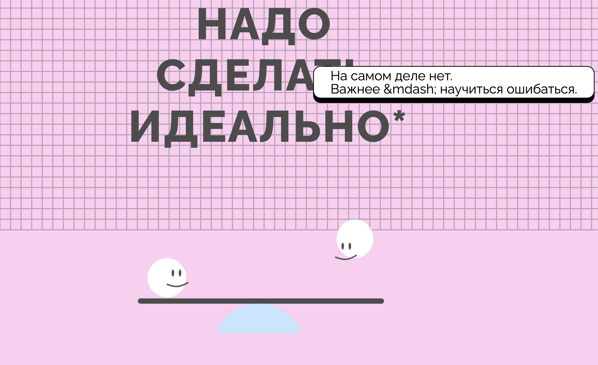

Проект про то, что важно научиться принимать свои ошибки перед тем, как достичь чего-то большого.

Используемые технологии:
- flex;
- position: relative, absolute;
- псевдоэлементы: ::before/ ::after;
- псевдоклассы: :hover

	&#169; Александра Боченина